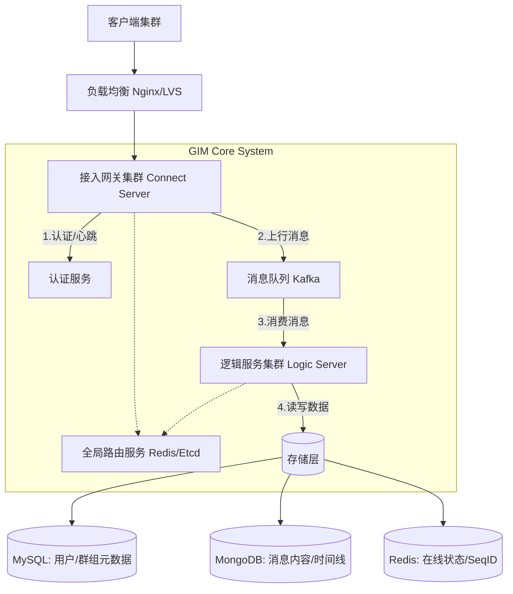

---

### ️ STRUCTURE.md

这份文档深入系统内部，详细阐述架构设计、技术选型理由及核心数据流转逻辑。

```markdown
# GIM 系统架构设计文档

## 1. 总体架构概览

GIM 采用经典的 **分层架构** 与 **微服务架构** 相结合的设计模式。系统被拆分为 **接入层**、**逻辑层** 和 **存储层**，各层之间通过 RPC 或消息队列进行解耦，以实现高内聚、低耦合。

### 架构拓扑图




## 2. 技术栈详解

| 模块 | 技术选型 | 选型理由 |
| :--- | :--- | :--- |
| **开发语言** | **Go (Golang)** | 原生支持高并发（Goroutine），内存占用低，非常适合网络密集型应用。 |
| **通信协议** | **WebSocket** | 全双工通信，浏览器原生支持，穿透防火墙能力强，节省带宽。 |
| **RPC 框架** | **gRPC** | 基于 HTTP/2，性能极高，强类型约束，适合内部微服务间的高效调用。 |
| **消息队列** | **Kafka** | 极高的吞吐量，持久化能力强，用于削峰填谷，保证消息在逻辑层处理时不丢失。 |
| **关系型数据库** | **MySQL** | ACID 特性保证用户关系、群组信息等元数据的一致性。 |
| **非关系型数据库** | **MongoDB** | Schema-less 特性完美适配富媒体消息（图片、语音、自定义信令），写入性能优异。 |
| **缓存/状态** | **Redis** | 极高的读写性能，用于存储用户在线状态、未读消息数、路由映射表。 |

## 3. 核心模块设计

### 3.1 接入层 (Connect Server)
- **职责**: 维护客户端长连接，处理心跳保活，鉴权，消息的上行透传与下行推送。
- **设计**: 采用 Reactor 模式，每个 TCP/WebSocket 连接绑定一个 Goroutine。维护一张本地 `ConnMap` (`UserID` -> `Connection`)。

### 3.2 逻辑层 (Logic Server)
- **职责**: 处理核心业务逻辑（好友校验、群权限、敏感词过滤），决定消息的存储与分发策略。
- **策略**:
    - **写扩散 (Push)**: 适用于单聊和小型群组。发送时直接将消息推送到接收者的收件箱。
    - **读扩散 (Pull)**: 适用于大型群组（如万人群）。消息仅存入群组公共时间线，成员上线后主动拉取。

### 3.3 路由层 (Router)
- **职责**: 解决“用户在哪里”的问题。
- **实现**: 当用户连接到 `Gateway-A` 时，在 Redis 中注册键值对 `UserID : Gateway-A-IP`。逻辑层需要发消息时，查询 Redis 找到目标网关 IP，通过 RPC 推送。

## 4. 数据流转逻辑

### 场景：用户 A 发送单聊消息给用户 B

1. **上行阶段 (Client -> Server)**
   - 用户 A 通过 WebSocket 发送消息包。
   - **Gateway-A** 接收包，校验签名与格式。
   - **Gateway-A** 将消息通过 RPC 发送给 **Logic Server**（或异步写入 Kafka）。

2. **处理阶段 (Logic Processing)**
   - **Logic Server** 收到请求，解析出 `Sender=A`, `Receiver=B`。
   - 查询 **MySQL** 确认 A 和 B 的关系状态。
   - **持久化**: 将消息内容写入 **MongoDB**，生成全局唯一的 `seq_id`，更新 A 和 B 的会话游标。

3. **下行阶段 (Server -> Client)**
   - **Logic Server** 查询 **Redis**，查找用户 B 当前连接的网关地址（假设是 `Gateway-B`）。
   - **Logic Server** 通过 RPC 调用 `Gateway-B` 的推送接口。
   - **Gateway-B** 在内存中找到 B 的连接句柄，通过 WebSocket 下发消息。
   - 用户 B 收到消息，返回应用层 ACK。

4. **离线处理**
   - 若 Redis 中未找到 B 的记录（B 离线），Logic Server 将消息标记为“离线消息”。
   - 当 B 上线连接至任意网关时，网关触发“同步接口”，Logic Server 对比 B 的本地 `seq_id` 与服务端 `seq_id`，自动拉取缺失的离线消息。